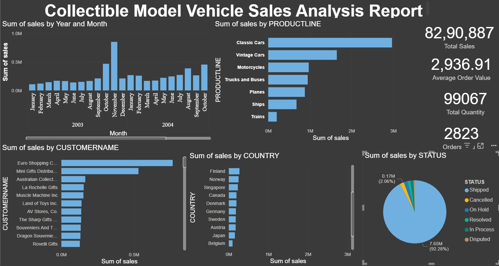
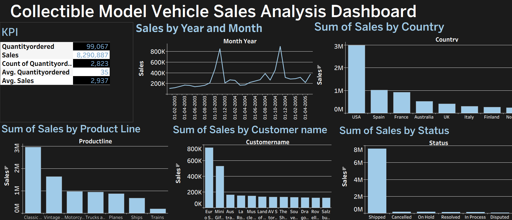

# Collectible-Model-Vehicle-Sales-Analysis-
Sales data analysis using Excel, SQL, Power BI, and Tableau — insights on product, region, and customer performance.
## 🧩 Tools Used
- Microsoft Excel – Pivot tables, charts, and basic analysis  
- BigQuery SQL – Data cleaning and preprocessing  
- Power BI – Data modeling and interactive dashboards  
- Tableau – Visual storytelling and KPIs

---

## 🚀 Key Insights
- Monthly Sales Trend: Peaks observed in November each year.  
- Top Product Lines: Classic Cars and Vintage Cars lead revenue.  
- Customer Insights: Top 10 customers contribute ~29% of total sales.  
- Regional Performance: USA and France dominate sales.  
- Order Status: 92% of revenue from shipped orders.

---

## 🧠 Learnings
- Data transformation using SQL  
- Dashboard creation using Power BI and Tableau  
- Cross-tool data analysis pipeline

---

## 📷 Dashboards
| Tool | Preview |
|------|----------|
| Power BI |  |
| Tableau |  |
| Excel |  |

---

## 🧑‍💻 Author
*Arshad*  
B.Sc. Computer Science | Data Enthusiast  
📧 [your-email@example.com]  
🌐 [LinkedIn Profile or Portfolio Link]
